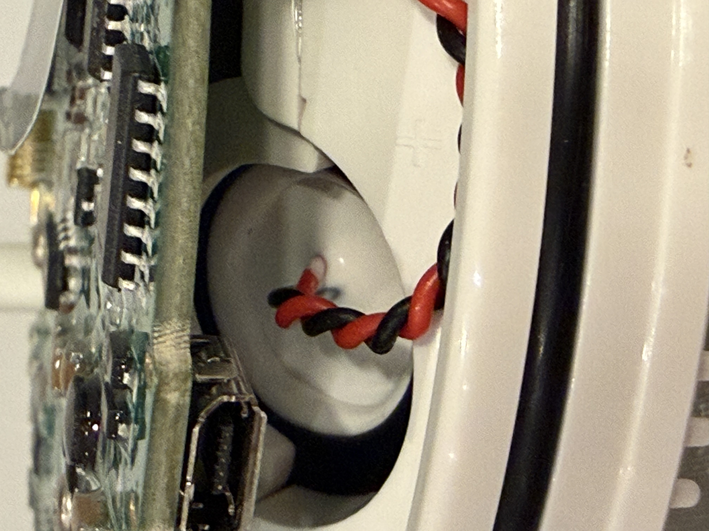

# Reverse Engineering the Ecowitt WS90

Before designing our own ultrasonic anemometer, it helps to see how commercial products solve the same problems. Today I tore down an Ecowitt WS90 to understand their approach.

<!-- more -->

## The WS90

The WS90 is a consumer-grade ultrasonic weather station that sells for around $150 -> $200. It measures wind speed/direction, temperature, humidity, UV, and light intensity. For the price point, it's interesting to see what engineering tradeoffs they made.

## Key Findings

### Mesh Reflector Instead of Solid Plate

The biggest surprise: the ultrasonic transducers reflect off a **metal mesh** rather than a solid plate. Most DIY designs use solid reflectors.

The mesh likely serves multiple purposes:

- **Drainage**: Water doesn't pool on the reflector surface
- **Debris clearing**: Dust, pollen, and small insects fall through
- **Reduced acoustic resonance**: A solid plate can ring, creating spurious echoes

The tradeoff is presumably some signal loss, but with properly tuned transducers and gain, this seems acceptable.

### Vibration Isolation on Transducers

Each ultrasonic transducer is mounted with **rubber isolation pieces**. This decouples the transducers from the housing mechanically.

Why this matters:

- **Reduces crosstalk**: Vibrations from one transducer firing won't mechanically couple to adjacent transducers
- **Wind noise rejection**: Housing vibrations from wind don't inject noise into the acoustic path
- **Temperature stability**: Rubber absorbs thermal expansion differences between the transducer and plastic housing

### STM32 Main Processor

The brains of the unit is an **STM32 microcontroller**. This is a solid choice—STM32 parts have good timer peripherals for precise ultrasonic timing measurements, low power modes for battery operation, and are well-documented.

### Mysterious Plastic Extrusions

The plate holding the ultrasonic transducers has numerous **plastic extrusion features** molded into the surface. Their purpose isn't immediately obvious.

My best guess: **multipath reflection mitigation**. In an ultrasonic anemometer, you want the sound to take a direct path from transducer to reflector and back. Any secondary reflections off the housing walls create ghost signals that corrupt the timing measurement.

These extrusions might:

- Break up coherent reflections from the housing walls
- Scatter sound energy that would otherwise create standing waves
- Provide acoustic baffling between transducer pairs

This is worth investigating further. If multipath is a significant issue, similar features might be needed in our open source design.

## Takeaways for LOAF

Several design decisions from the WS90 are worth considering:

1. **Mesh reflectors** could solve the water/debris problem elegantly
2. **Rubber isolation** for transducers seems essential for reliable operation
3. **STM32** is a reasonable processor choice, aligns with QingStation's approach
4. **Multipath mitigation** in the housing design needs more research

Next step: bench testing to understand how much these features matter for accuracy.
