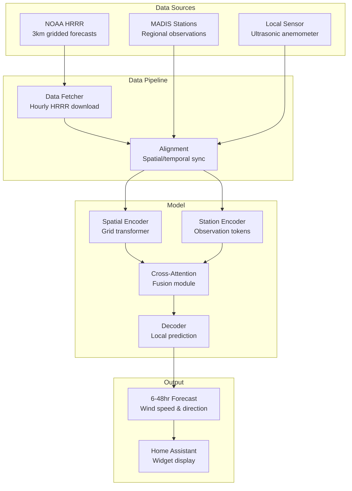

# LOAF (Local Observations and Atmospheric Forecasting)

Open source hyperlocal weather forecasting you can deploy yourself.

## Why LOAF?

Standard weather forecasts operate on 3km grids. That resolution can't capture the wind patterns at your specific site—whether it's a backyard wind turbine, a fire-prone hillside, or a remote research station.

Recent ML research shows that fusing gridded forecasts with local sensor data via transformers can reduce prediction error by up to 80%. Commercial services like Tomorrow.io offer this, but they're proprietary and subscription-based. The academic code exists, but there's no practical way to go from "I have a Raspberry Pi" to "I have hyperlocal forecasts."

LOAF bridges that gap: open source hardware, open source models, no vendor lock-in. Build a sensor, train a model for your region, run inference locally.

**Built on research from MIT Earth Intelligence Lab:**

- [Earth-Intelligence-Lab/LocalizedWeather](https://github.com/Earth-Intelligence-Lab/LocalizedWeather)
- Yang, Q., et al. (2024). [Local Off-Grid Weather Forecasting with Multi-Modal Earth Observation Data](https://arxiv.org/abs/2410.12938)

## Architecture

## Data Flow

1. **Gridded Forecasts**: NOAA HRRR provides 3km resolution wind forecasts, downloaded hourly
2. **Station Observations**: MADIS network stations provide ground truth from the surrounding region
3. **Local Sensor**: DIY ultrasonic anemometer captures hyperlocal conditions
4. **Fusion**: Multi-modal transformer combines coarse forecasts with sparse observations
5. **Prediction**: Model outputs corrected forecasts for the exact sensor location

## Hardware Stack

| Component | Description |
|-----------|-------------|
| Sensor | DIY ultrasonic anemometer (40kHz transducers) |
| Logger | Raspberry Pi 4 with RS-485 interface |
| Power | 20W solar panel + 12V battery |
| Enclosure | 3D printed weatherproof housing |

## Model Architecture

The transformer architecture processes two input streams:

- **Spatial encoder**: Treats HRRR grid points as tokens, applies self-attention to capture regional patterns
- **Station encoder**: Each weather station becomes a token with positional encoding based on lat/lon
- **Cross-attention fusion**: Target location queries both encoders to aggregate relevant information
- **Decoder**: Predicts wind speed/direction at forecast horizons (6-48 hours)

Training uses historical HRRR forecasts paired with MADIS observations (2020-2024), validated against held-out local sensor data.
